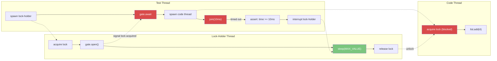
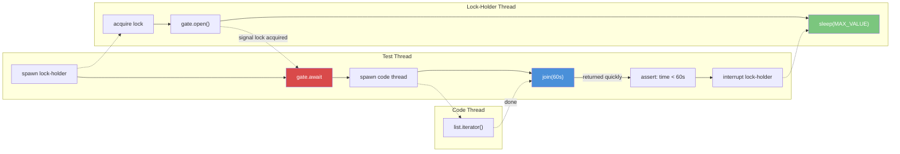

# Thread safety testing

This module tests that Eclipse Collections' thread-safe wrappers (synchronized and multi-reader collections) acquire locks when they should and don't when they shouldn't.

## How it works

Three threads cooperate to test whether a collection operation acquires the lock:

```java
// Lock-Holder Thread: hold the lock forever (until interrupted)
synchronized (list) {
    gate.open();                    // signal that the lock is held
    Thread.sleep(Long.MAX_VALUE);   // hold the lock until interrupted
}

// Code Thread: just run the operation under test
list.add(4);

// Test Thread: coordinate the other two and measure timing
lockHolderThread.start();
gate.await();                       // wait until lock-holder has the lock
codeThread.start();
codeThread.join(10);                // wait up to 10ms for code thread
assert(measuredTime >= 10);         // if it took >= 10ms, the code thread was blocked
lockHolderThread.interrupt();       // release the lock, clean up
```

A `Gate` (`CountDownLatch`) coordinates the threads. The test thread must not start the code thread until the lock-holder has acquired the lock, or the timing measurement would be meaningless.

Some operations like `add()` are expected to acquire the lock. Others like `iterator()` are not. Both cases are tested.

### Asserting that an operation acquires a lock

Operations like `add()` must acquire the collection's lock. When the lock-holder thread already holds it, the code thread blocks. A short 10ms timeout is used: if the code thread is still blocked after 10ms, the lock is confirmed.



Red nodes are blocked waiting for something. Green is sleeping while holding the lock. Solid arrows show same-thread sequential flow. Dotted arrows show cross-thread causality.

`join(10ms)` waits for the code thread to finish, but it never does because `list.add(4)` is blocked trying to acquire the lock that the lock-holder has. After 10ms the join times out. The assert checks that `measuredTime >= 10ms`, confirming the code thread was blocked. The interrupt then wakes the lock-holder, which releases the lock, finally allowing `list.add(4)` to complete. By that point the test is already done measuring.

### Asserting that an operation does not acquire a lock

Operations like `iterator()` should not acquire the collection's lock. The code thread completes immediately despite the lock being held. A 60-second timeout is used so that even a slow or heavily loaded CI machine won't cause a false negative.



Blue means not blocked. The join returns immediately.
`iterator()` doesn't acquire the lock, so the code thread completes immediately even though the lock-holder has the lock. The join returns right away, `measuredTime < 60s`, and the assert passes. The interrupt is just cleanup.

## Why 10ms and 60s?

The two timeouts are deliberately far apart.

10ms is the "assert blocked" timeout. A non-blocking operation completes in microseconds, well under 10ms, so if the thread is still stuck after 10ms it was clearly blocked by the lock. The tradeoff is that every "assert blocked" check costs at least 10ms of wall-clock time.

60s is the "assert not blocked" timeout. An uncontended operation finishes almost instantly, so the 60-second limit is never reached in practice. The large timeout prevents a slow CI machine from producing a false negative.
